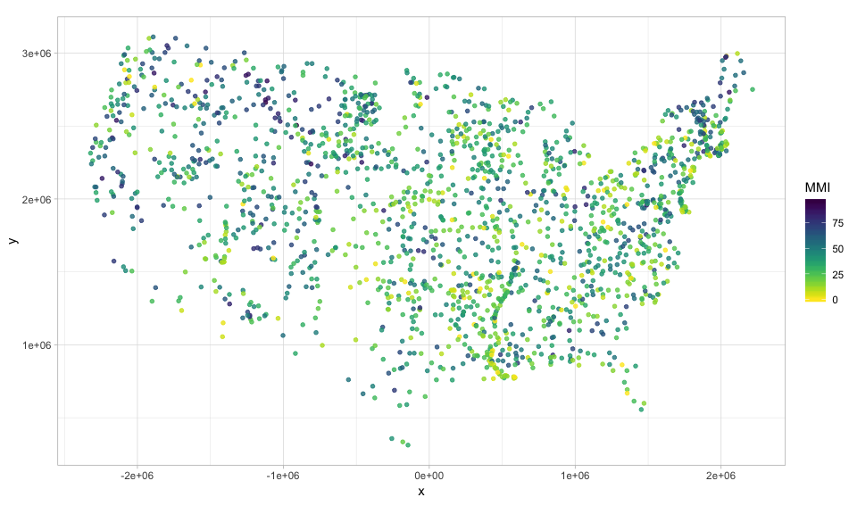
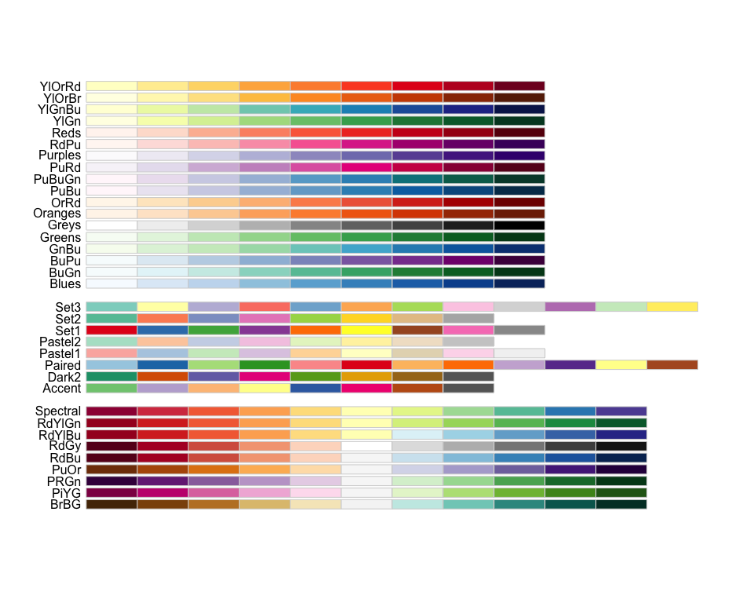
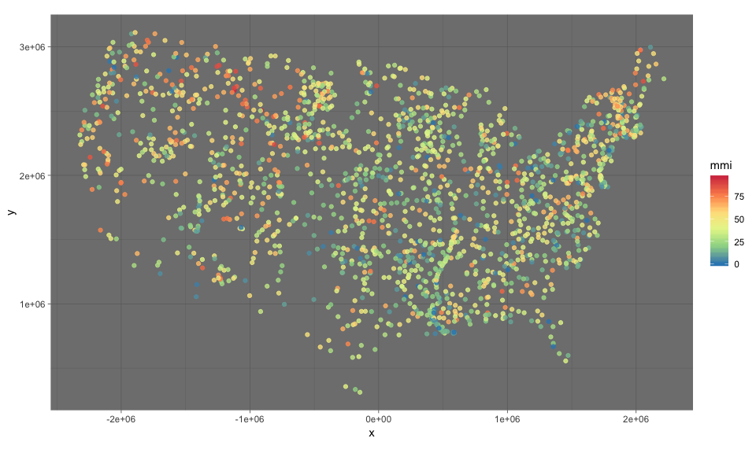
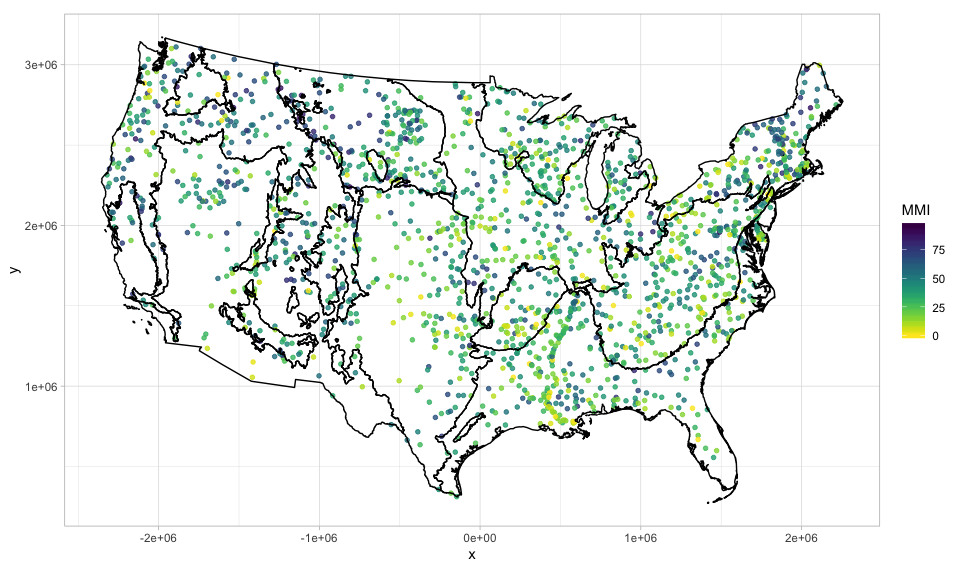
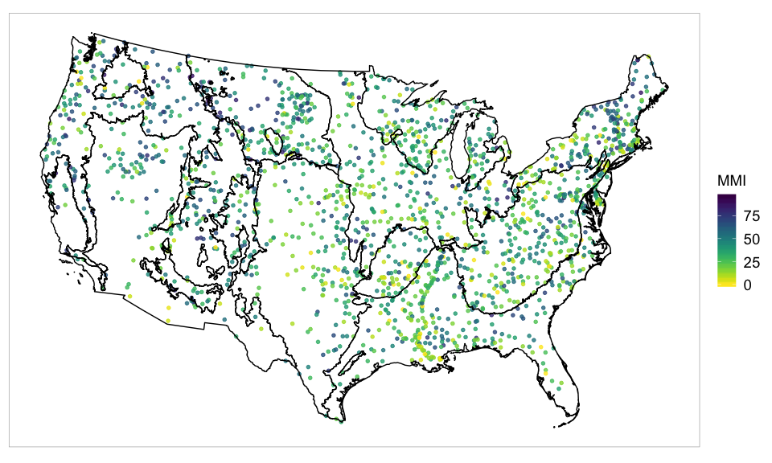
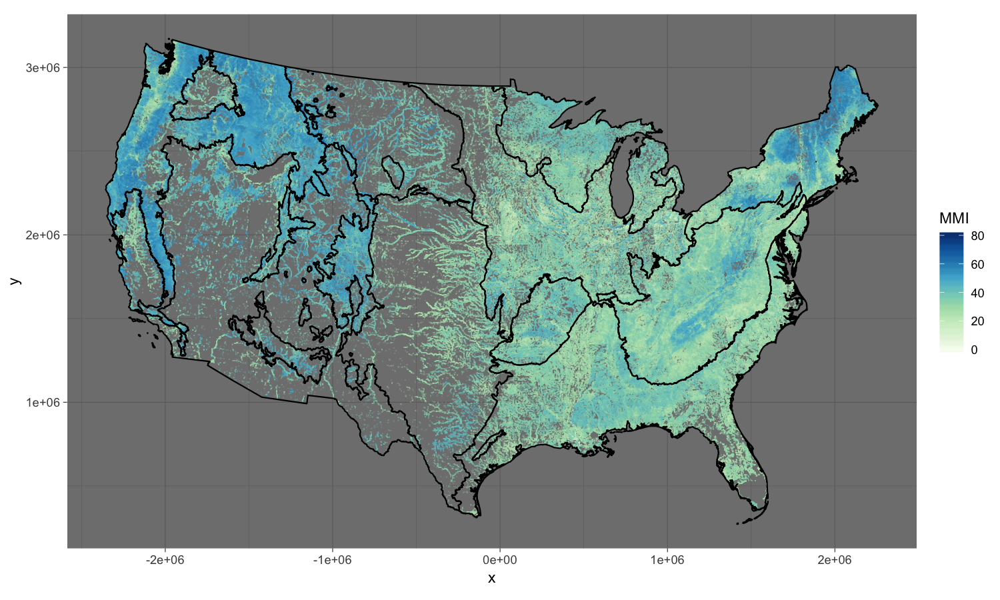

This R Markdown report provides a description of the R code I used to create a map of the sampled MMI scores from the EPA's 2008/09 National Rivers and Stream Assessment (NRSA).  It also contains the R code I used to create a map of the predicted MMI scores (from a random forest model) at all 1.1 million perennial streams across the conterminous US.

This is for a presentation I gave for Prof. Joshua Kerr's Data Visualization course at Cal State East Bay.


```r
library(ggplot2)
library(raster)
library(sp)
library(rgdal)
library(maps)
library(maptools)
library(rgeos)
library(viridis)
```

# Load the MMI data set
The data frame contains the Albers x and y coordinates, MMI scores, and MMI condition classes (good, fair, poor), for the stream sites sampled for the 2008/09 NRSA.  

```r
mmi_samp_data <- read.csv('mmi_samp_data.csv')
head(mmi_samp_data)
```

```
##          x         y   mmi mmi_class
## 1 842524.9 1168653.7 29.58      Poor
## 2 850717.3 1192050.5 22.75      Poor
## 3 840644.8  995227.7 34.25      Poor
## 4 887177.1 1245959.9 49.65      Good
## 5 893620.2 1147963.5 24.40      Poor
## 6 755733.2 1258108.8 25.68      Poor
```

```r
dim(mmi_samp_data)
```

```
## [1] 1859    4
```
Note that the Albers Equal Area projection is commonly used by the EPA and other government agencies (USGS, NOAA) when working with spatial data.  The Albers projection is recommended when computing distances between locations in the conterminous US.

# Plot of MMI sampling locations
I used the [viridis color palette](https://cran.r-project.org/web/packages/viridis/vignettes/intro-to-viridis.html) to color the points according to their MMI scores.  The viridis color palette is designed to be perceptually uniform, robust to color blindness, and print well in grey scale.

```r
g <- ggplot(mmi_samp_data, aes(x, y)) +
  geom_point(size=1.25, alpha=0.8, aes(colour=mmi)) +
  scale_color_viridis(name='MMI', direction=-1) +
  coord_fixed() + theme_light() 
g
```

<!-- -->

## Other palettes and themes

```r
library(RColorBrewer)
display.brewer.all()
```

<!-- -->


```r
g <- ggplot(mmi_samp_data, aes(x,y, colour=mmi)) +
  geom_point(alpha=0.8) +
  scale_colour_distiller(palette='Spectral') + 
  coord_fixed()
g + theme_light()
```

<!-- -->

```r
# change background theme
g + theme_dark()
```

<!-- -->

# Map with ecoregion boundaries
The ecoregion polygons are stored in a shape file.  Use `readOGR()` to read in this shape file, which R then recognizes a `SpatialPolygonsDataFrame` object (this is one of spatial data classes provided in the `sp` library).   

```r
# load in shape file for ecoregion boundries
eco9 <- readOGR('ecoregions', layer='Aggr_Eco9_2015', verbose=F)

class(eco9)
```

```
## [1] "SpatialPolygonsDataFrame"
## attr(,"package")
## [1] "sp"
```

```r
slotNames(eco9)
```

```
## [1] "data"        "polygons"    "plotOrder"   "bbox"        "proj4string"
```

```r
eco9@data
```

```
##   WSA9             WSA9_NAME
## 0  CPL        Coastal Plains
## 1  NAP Northern Appalachians
## 2  NPL       Northern Plains
## 3  SAP Southern Appalachians
## 4  SPL       Southern Plains
## 5  TPL      Temporate Plains
## 6  UMW         Upper Midwest
## 7  WMT     Western Mountains
## 8  XER                 Xeric
```

```r
eco9@proj4string # Albers projection
```

```
## CRS arguments:
##  +proj=aea +lat_1=29.5 +lat_2=45.5 +lat_0=23 +lon_0=-96 +x_0=0
## +y_0=0 +datum=NAD83 +units=m +no_defs +ellps=GRS80 +towgs84=0,0,0
```

```r
# simplify ecoregion layer to speed up plotting
eco9simp <- gSimplify(eco9, tol=1000, topologyPreserve = TRUE)
eco9simp <- SpatialPolygonsDataFrame(eco9simp, eco9@data)

# use fortify to transform into data frame for use in ggplot2
eco9df <- fortify(eco9simp, region = 'WSA9')
names(eco9df)[1:2] <- c('x', 'y') 

g <- ggplot(mmi_samp_data, aes(x, y)) +
  geom_point(size=1.25, alpha=0.8, aes(colour=mmi)) +
  scale_color_viridis(name='MMI', direction=-1) +
  coord_fixed() + theme_light() + 
  geom_polygon(data = eco9df, aes(x, y, group = group), fill = NA, colour = 'black')
g
```

<!-- -->
Note that `gSimplify()` uses the so-called Douglas-Peuker algorithm.  The Wikipedia article for this states: "the purpose of the algorithm is, given a curve composed of line segments, to find a similar curve with fewer points".  Using `gSimplify()` substantially speeds up plotting without causing any perceptible difference in the map of the ecoregion boundaries.  

## Formatting
To improve the presentation of the map I removed the text and labels on the axes, and the grid lines. I also enlarged the legend text.

```r
g2 <- g + theme(axis.title.x=element_blank(), axis.ticks.x=element_blank(), axis.text.x = element_blank(),
    axis.title.y=element_blank(), axis.ticks.y=element_blank(), axis.text.y = element_blank(),
    panel.grid.minor = element_blank(), panel.grid.major = element_blank(),
    legend.text = element_text(size=14), legend.title = element_text(size=14))
g2
```

<!-- -->

# Prediction map
First load the prediction data frame into R.  It contains the Albers `x` and `y` coordinates for each of the 1.1 million stream catchments, and the associated random forest predictions for MMI.

```r
mmi_pred_data <- read.csv('mmi_pred_data.csv')
head(mmi_pred_data)
```

```
##           x         y   rfPred
## 1  130307.2  890726.1 34.77505
## 2 2140343.8 2876529.5 47.47153
## 3 2105546.5 2891758.4 50.34259
## 4 2106512.5 2890030.7 53.01215
## 5 2106512.5 2890030.7 53.94801
## 6 2106842.8 2888366.8 57.57320
```

```r
dim(mmi_pred_data)
```

```
## [1] 1081811       3
```

There are over a million points plotted on the prediction map below.  To visualize such a large number of points with ggplot2, in `geom_point()` the argument `shape` is set to 46, which is the smallest possible point size, and the `alpha` is adjusted to make the points transparent.  

```r
g <- ggplot(mmi_pred_data, aes(x, y)) +
  geom_point(aes(colour = rfPred), shape = 46, alpha = 0.2) +
  scale_colour_gradientn(colours = brewer.pal(9, 'GnBu'), limits = c(0,80),
    guide = guide_colorbar(title = 'MMI')) +
  coord_fixed() + theme_dark() +
  geom_polygon(data = eco9df, aes(x, y, group = group), fill = NA, colour = 'black')
g
```

<!-- -->


# Links

[Viridis color palettes](https://cran.r-project.org/web/packages/viridis/vignettes/intro-to-viridis.html)

[Wikipedia on Douglas-Peuker algorithm](https://en.wikipedia.org/wiki/Ramer%E2%80%93Douglas%E2%80%93Peucker_algorithm)

[Plotting polygon shapefiles in ggplot2](https://github.com/tidyverse/ggplot2/wiki/plotting-polygon-shapefiles) 

